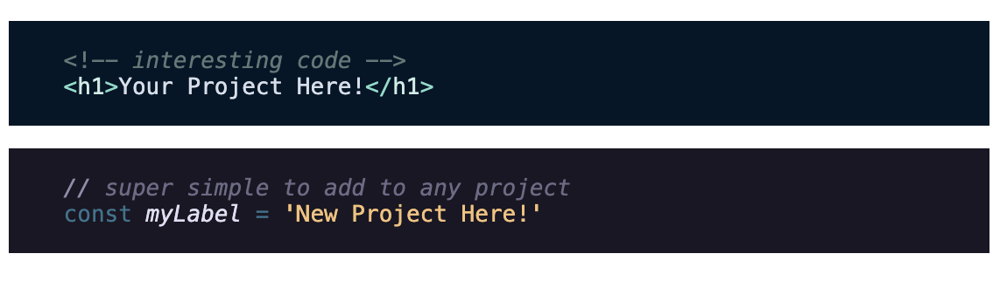

# shiki-component

Web Component for showing code with syntax highlighting, using [Shiki](https://shiki.style/).

Live Example: https://codepen.io/JRJurman/pen/xxeQQxa



```html
<script type="module" src="https://unpkg.com/shiki-component@1"></script>

<shiki-component lang="html" theme="night-owl">
  <template>
    <!-- interesting code -->
    <h1>Your Project Here!</h1>
  </template>
</shiki-component>

<shiki-component lang="js" theme="rose-pine">
  <template>
    // super simple to add to any project
    const myLabel = 'New Project Here!'
  </template>
</shiki-component>
```

## API

<dl>
<dt><code>lang</code></dt>
<dd>

Attribute for setting the language for syntax highlighting. You can see all supported languages here:
https://shiki.style/languages

</dd>

<dt><code>theme</code></dt>
<dd>

Attribute for setting the theme for the syntax highlighting. You can see all themes here: https://shiki.style/themes

</dd>

<dt><code>*-theme</code></dt>
<dd>

Attribute for setting multiple themes for the syntax highlighting. You can learn about setting multiple themes here: https://shiki.style/guide/dual-themes

</dd>

</dl>
